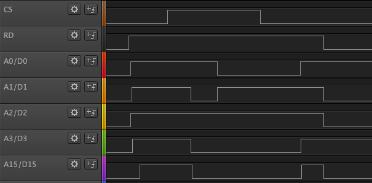
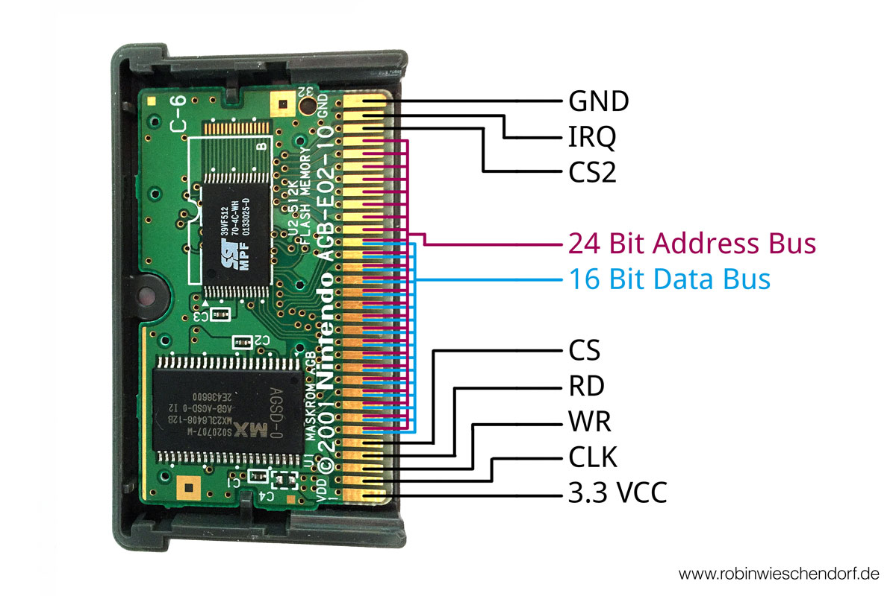

# GameboyAdvanceRomDumper
Arduino Uno based Gameboy Advance (GBA) rom dumper 

## Timing
### Non sequential access / latch address
- set `RD` to `high`
- set `CS` to `high`
- put address on bus
- set `CS` to `low` to latch address
- set `RD` to `low` to put data on the bus
- now you can read data from bus

*image: Timing Diagram with Program Logic Saleae*

### Sequential access (address + 1)
If an address has already been set, you can get to the next address as follows.
If no address is set, you have to set one as described in section `Non sequential access / latch address`.

- set `RD` to `high`
- set `RD` to `low` to put data on the bus
- now you can read data from bus

## Connections

We can only put a 16 bit address on the bus with `Non sequential access / latch address`, because the
Arduino has not enough I/O ports. Every address above 16 bit can be reached with `Sequential access`

The data / address (D/A) bus pins are between `CS` and `CS2`. `(... RD, CS, D/A 0 ...  D/A 15 ... A 23, CS2 ...)`. We
only use `D/A 0` to `D/A 15`.

| ROM Pin-Name | Arduino Pin-Name | Atmega328P Port-Name |
|--------------|------------------|----------------------|
| VCC          | 3.3V             |                      |
| CLK (unused) | (not connected)  |                      |
| WR           | GND              |                      |
| RD           | 12               | PB4 (PORT-B 4)       |
| CS           | 13               | PB5 (PORT-B 5)       |
| D/A 0        | 2                | PD2 (PORT-D 2)       |
| D/A 1        | 3                | PD3 (PORT-D 3)       |
| D/A 2        | 4                | PD4 (PORT-D 4)       |
| D/A 3        | 5                | PD5 (PORT-D 5)       |
| D/A 4        | 6                | PD6 (PORT-D 6)       |
| D/A 5        | 7                | PD7 (PORT-D 7)       |
| D/A 6        | A0               | PC0 (PORT-C 0)       |
| D/A 7        | A1               | PC1 (PORT-C 1)       |
| D/A 8        | A2               | PC2 (PORT-C 2)       |
| D/A 9        | A3               | PC3 (PORT-C 3)       |
| D/A 10       | A4               | PC4 (PORT-C 4)       |
| D/A 11       | A5               | PC5 (PORT-C 5)       |
| D/A 12       | 8                | PB0 (PORT-B 0)       |
| D/A 13       | 9                | PB1 (PORT-B 1)       |
| D/A 14       | 10               | PB2 (PORT-B 2)       |
| D/A 15       | 11               | PB3 (PORT-B 3)       |
| CS2          | 3.3V             |                      |
| IRQ          | GND              |                      |
| GND          | GND              |                      |

## Links
- http://web.archive.org/web/20180426222911/http://reinerziegler.de/GBA/gba.htm
- https://robinwieschendorf.de/2016/04/gameboy-advance-rom-dumper-mit-arduino-uno/
